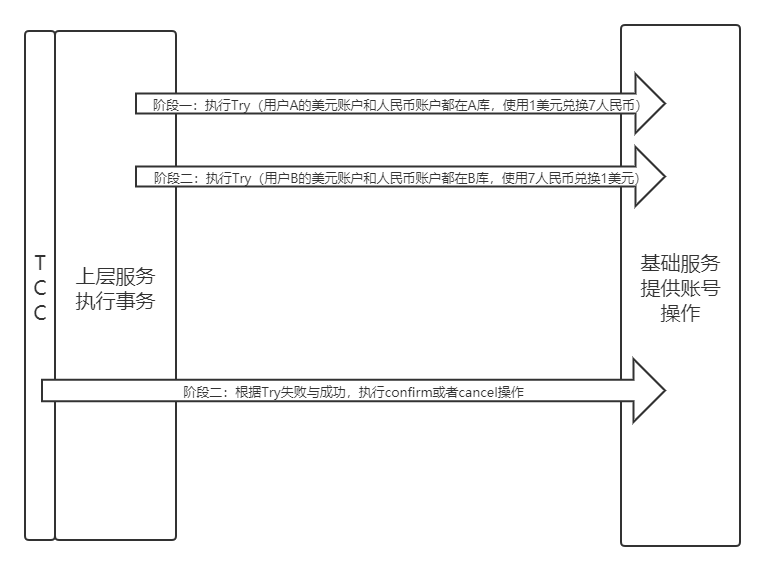

# Himly TCC Dubbo 程序示例
***
## 工程运行说明
- 1.运行底层基础服务（provider）：account工程下的 AccountServiceApplication
- 2.运行业务层测试：transaction工程下的 TransactionServiceApplication

### 相关思路和原理
&ensp;&ensp;&ensp;&ensp;需要了解两个概念：TCC和RPC，可以参考下面两个Demo的思路部分说明：

- [TCC Demo](https://github.com/lw1243925457/JAVA-000/tree/main/homework/rpc/rpc-demo)
- [RPC Demo](https://github.com/lw1243925457/JAVA-000/tree/main/homework/TCCDemo)

&ensp;&ensp;&ensp;&ensp;下面简单说下思路：

&ensp;&ensp;&ensp;&ensp;根据之前缩写的TCC Demo程序的思路，使用 TCC 就是为了将 confirm和cancel的操作委托给第三方，在程序本身程序try后，由TCC第三方来推动进行下面的阶段

&ensp;&ensp;&ensp;&ensp;结合Dubbo的话，根据RPC的思路，为了简化客户端（provider）的使用，具体的函数调用都放到基础服务端

&ensp;&ensp;&ensp;&ensp;以本程序为例，大致流程图如下：



&ensp;&ensp;&ensp;&ensp;可以看到阶段一（try阶段）都是程序本身在使用RPC的方式进行调用执行

&ensp;&ensp;&ensp;&ensp;后面的confirm和cancel由TCC框架来进入RPC调用执行（在himly中全局的那个切面中）

&ensp;&ensp;&ensp;&ensp;从日志运行中也可以看出，具体的调用日志全打印在基础工程（Account）中

## 代码编写
&ensp;&ensp;&ensp;&ensp;简化操作，就将Api和provider层放到一起了，大致就下面两个步骤：

- 1.provider（Account基础服务编写）：提供账号金额操作，作为Dubbo中的Provider
- 2.consumer（Transection上层服务编写）：进行A和B用户的转账，作为Dubbo的Consumer

### 环境配置
&ensp;&ensp;&ensp;&ensp;Dubbo需要zookeeper，这里使用docker进行启动，方便使用：

```shell script
# 第一次启动zk
docker run -dit --name zk -p 2181:2181 zookeeper

# 曾经启动过zk，则可以：停止、启动、重启 zk
docker stop/start/restart zk
```

### 1.provider（Account基础服务编写）：提供账号金额操作，作为Dubbo中的Provider
&ensp;&ensp;&ensp;&ensp;首先编写API和具体实现，大致代码如下：

```java
public interface AccountService {

    /**
     * 美元账户和人民币账户交易
     * @param account account
     * @return bool
     */
    @Hmily
    boolean pay(Account account);
}


@Slf4j
@Service("accountService")
public class AccountServiceImpl implements AccountService {

    @Autowired
    private AccountMapper accountMapper;

    @Override
    @HmilyTCC(confirmMethod = "confirm", cancelMethod = "cancel")
    public boolean pay(Account account) {
        boolean isSuccess = accountMapper.payment(account);
        log.info("py account : + " + account.getId() + " try result: " + isSuccess);
        log.info("py account : + " + account.getId() + " try data: " + accountMapper.queryOne(account));
        return isSuccess;
    }

    @Transactional(rollbackFor = Exception.class)
    public boolean confirm(Account account) {
        log.info("============dubbo tcc 执行确认付款接口===============");
        log.info("param account : " + account.toString());
        return true;
    }

    @Transactional(rollbackFor = Exception.class)
    public boolean cancel(Account account) {
        log.info("============ dubbo tcc 执行取消付款接口===============");
        log.info("param account : " + account.toString());
        return true;
    }
}
```

&ensp;&ensp;&ensp;&ensp;进行Dubbo Provider的配置，大致配置如下：

```xml
<?xml version="1.0" encoding="UTF-8"?>
<beans xmlns="http://www.springframework.org/schema/beans"
       xmlns:xsi="http://www.w3.org/2001/XMLSchema-instance"
       xmlns:dubbo="http://code.alibabatech.com/schema/dubbo"
       xsi:schemaLocation="http://www.springframework.org/schema/beans
       http://www.springframework.org/schema/beans/spring-beans.xsd
       http://code.alibabatech.com/schema/dubbo
       http://code.alibabatech.com/schema/dubbo/dubbo.xsd">

    <dubbo:application name="account_service"/>

    <dubbo:registry protocol="zookeeper" address="localhost:2181"/>

    <dubbo:protocol name="dubbo" port="-1"
                    server="netty" client="netty"
                    charset="UTF-8" threadpool="fixed" threads="500"
                    queues="0" buffer="8192" accepts="0" payload="8388608" />

    <!--    这里提供一个账号金额操作基础服务，ref="accountService",注意和AccountServiceImpl的名称对应-->
    <dubbo:service interface="com.account.demo.service.AccountService"
                   ref="accountService" executes="20"/>

</beans>
```

&ensp;&ensp;&ensp;&ensp;进行主函数配置，加载Dubbo配置，关闭tomcat，使用Dubbo内置通信

```java
@SpringBootApplication
@ImportResource({"classpath:spring-dubbo.xml"})
public class AccountServiceApplication {

    public static void main(String[] args) {
        SpringApplication springApplication = new SpringApplication(AccountServiceApplication.class);
        springApplication.setWebApplicationType(WebApplicationType.NONE);
        springApplication.run(args);
    }
}
```

&ensp;&ensp;&ensp;&ensp;就此Provider端就搭建完成了，相关的数据库操作这里就不赘述了

### 2.consumer（Transection上层服务编写）：进行A和B用户的转账，作为Dubbo的Consumer
&ensp;&ensp;&ensp;&ensp;引入Api（Service接口）的相关依赖，这里就简单添加Provider的模块了

```xml
<!--        account service api-->
<dependency>
    <groupId>com.account</groupId>
    <artifactId>demo</artifactId>
    <version>0.0.1-SNAPSHOT</version>
</dependency>
```
&ensp;&ensp;&ensp;&ensp;编写业务处理具体代码，大致如下：

```java
@Service
@Slf4j
public class TransactionServiceImpl implements TransactionService {

    final private AccountService accountService;

    /**
     * 这个注入很关键，这样注入就能进入RPC的切面，没有就报错
     * @param accountService
     */
    @Autowired(required = false)
    public TransactionServiceImpl(AccountService accountService) {
        this.accountService = accountService;
    }

    @Override
    @HmilyTCC(confirmMethod = "confirmOrderStatus", cancelMethod = "cancelOrderStatus")
    public void transaction() {
        transactionA();
        transactionB();
    }

    private void transactionA() {
        log.info("============py one dubbo try 执行确认付款接口===============");
        Account account = new Account();
        account.setId(1L);
        account.setUs_wallet(-1L);
        account.setCny_wallet(7L);
        accountService.pay(account);
    }

    private void transactionB() {
        log.info("============py two dubbo try 执行确认付款接口===============");
        Account account = new Account();
        account.setId(2L);
        account.setUs_wallet(1L);
        account.setCny_wallet(-7L);
        accountService.pay(account);
    }

    public void confirmOrderStatus() {
        log.info("=========进行订单confirm操作完成================");
    }

    public void cancelOrderStatus() {
        log.info("=========进行订单cancel操作完成================");
    }
}
```

&ensp;&ensp;&ensp;&ensp;配置Dubbo的Consumer，大致如下，指明Api服务：

```xml
<?xml version="1.0" encoding="UTF-8"?>

<beans xmlns="http://www.springframework.org/schema/beans"
       xmlns:xsi="http://www.w3.org/2001/XMLSchema-instance"
       xmlns:dubbo="http://code.alibabatech.com/schema/dubbo"
       xsi:schemaLocation="http://www.springframework.org/schema/beans
       http://www.springframework.org/schema/beans/spring-beans.xsd
       http://code.alibabatech.com/schema/dubbo
       http://code.alibabatech.com/schema/dubbo/dubbo.xsd">

    <dubbo:application name="order_service"/>


    <dubbo:registry protocol="zookeeper" address="localhost:2181"/>

    <dubbo:protocol name="dubbo" port="20886"
                    server="netty" client="netty"
                    charset="UTF-8" threadpool="fixed" threads="500"
                    queues="0" buffer="8192" accepts="0" payload="8388608"/>

    <dubbo:reference timeout="500000000"
                     interface="com.account.demo.service.AccountService"
                     id="accountService"
                     retries="0" check="false" actives="20" loadbalance="hmilyRandom"/>
</beans>
```
&ensp;&ensp;&ensp;&ensp;配置Dubbo的Consumer文件路径，运行业务代码测试，大致如下：

```java
@SpringBootApplication
@ImportResource({"classpath:spring-dubbo.xml"})
public class TransactionServiceApplication implements ApplicationRunner {

    @Autowired
    private TransactionService transactionService;

    public static void main(String[] args) {
        SpringApplication.run(TransactionServiceApplication.class, args);
    }

    @Override
    public void run(ApplicationArguments args) throws Exception {
        transactionService.transaction();
    }
}
```

## 总结
&ensp;&ensp;&ensp;&ensp;前期写代码思路不够清晰，导致花费了很多的时间，在理清思路以后，没多久就重新写出来了。

&ensp;&ensp;&ensp;&ensp;可见了解相关原理非常重要的，在使用框架的工程中能大致做到心中有数，能猜测需要进行哪些步骤。

&ensp;&ensp;&ensp;&ensp;金额交易部分就省略很多了，重点还是体现TCC和Dubbo的结合使用吧，不得不对RPC真的挺好用